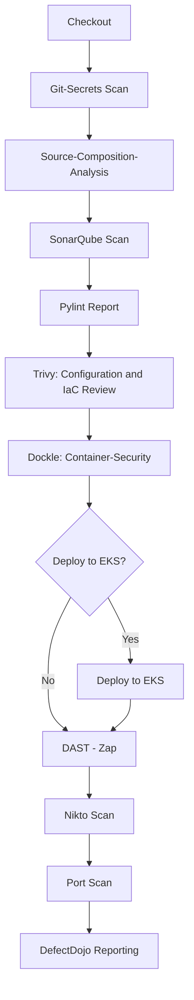

# DevSecOps-Jenkins

This repository showcases a secure CI/CD pipeline using Jenkins. It includes various stages for code analysis, security scanning, and deployment, ensuring that the code is secure and high-quality before being deployed.

## Repository Structure

The repository contains the following key files and directories:

- **jenkinsfile**: The main Jenkins pipeline script which defines the stages and steps for the CI/CD process.
- **devops/**: Directory containing various shell scripts used within the Jenkins pipeline for different purposes like scanning and analysis.
  - **SAST_Fortify.sh**: A script used for static application security testing (SAST) using Fortify.
  - **blackduck.sh**: A script used for scanning open-source dependencies for vulnerabilities using Black Duck.
  - **fortifymerge.sh**: A script used for merging Fortify scan results.

## Jenkins Pipeline

The Jenkins pipeline defined in the `jenkinsfile` includes several stages to ensure the code is properly checked, analyzed, and deployed securely. Below is an overview of each stage and the tools implemented.

### Stages

1. **Checkout**
   - **Purpose**: To checkout the source code from the repository.
   - **Tools**: Git

2. **Git-Secrets Scan**
   - **Purpose**: To scan the code for any hardcoded secrets using truffleHog and detect-secrets.
   - **Tools**: truffleHog, detect-secrets

3. **Source-Composition-Analysis**
   - **Purpose**: To analyze the dependencies and check for vulnerabilities.
   - **Tools**: OWASP Dependency-Check

4. **SonarQube Scan**
   - **Purpose**: To perform static code analysis using SonarQube.
   - **Tools**: SonarQube

5. **Pylint Report**
   - **Purpose**: To lint Python code and generate a report.
   - **Tools**: Pylint

6. **Trivy: Configuration and IaC Review**
   - **Purpose**: To scan for vulnerabilities and misconfigurations in the infrastructure as code files.
   - **Tools**: Trivy

7. **Dockle: Container-Security**
   - **Purpose**: To analyze Docker images for security issues.
   - **Tools**: Dockle

8. **Deploy to EKS**
   - **Purpose**: To deploy the application to Amazon EKS (Elastic Kubernetes Service).
   - **Tools**: Kubernetes, AWS ECR

9. **DAST - Zap**
   - **Purpose**: To perform dynamic application security testing using OWASP ZAP.
   - **Tools**: OWASP ZAP

10. **Nikto Scan**
    - **Purpose**: To scan the web server for vulnerabilities using Nikto.
    - **Tools**: Nikto

11. **Port Scan**
    - **Purpose**: To perform a port scan to check for open ports and services.
    - **Tools**: Nmap

12. **DefectDojo Reporting**
    - **Purpose**: To report scan results to DefectDojo for further analysis and tracking.
    - **Tools**: DefectDojo

### Post Actions

- **Cleanup**: Always clean up the workspace after the build.
- **Failure Notification**: Send an email notification if the build fails.

## Diagrams

### Pipeline Workflow

## Additional Scripts

### SAST_Fortify.sh
- **Purpose**: To perform static application security testing (SAST) using Fortify.
- **Usage**: This script is used within the Jenkins pipeline to scan the codebase for potential security vulnerabilities using Fortify.

### blackduck.sh
- **Purpose**: To scan open-source dependencies for vulnerabilities using Black Duck.
- **Usage**: This script is used to ensure that open-source components are free from known vulnerabilities.

### fortifymerge.sh
- **Purpose**: To merge Fortify scan results.
- **Usage**: This script is used to consolidate and merge results from multiple Fortify scans.

## Conclusion

This Jenkins pipeline ensures that the application code is thoroughly analyzed, scanned for vulnerabilities, and securely deployed to the production environment. By integrating various tools at different stages, this pipeline maintains high code quality and security standards.
