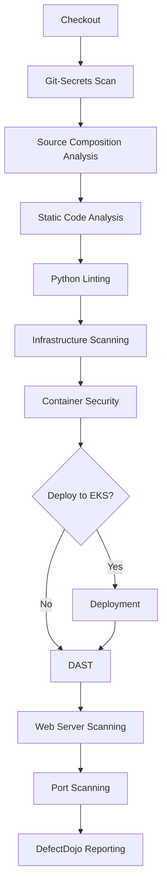
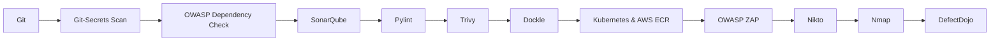
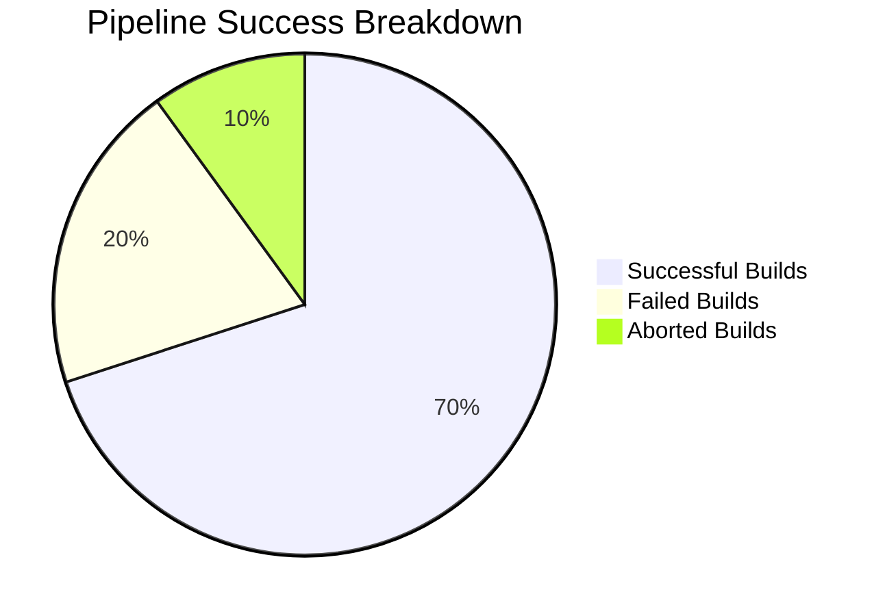

# DevSecOps-Jenkins

Welcome to the **DevSecOps-Jenkins** repository! This project highlights a robust and secure CI/CD pipeline implemented with Jenkins. The pipeline integrates advanced security scanning, static code analysis, and seamless deployment, ensuring a secure software delivery lifecycle.

---

## Repository Overview

### Key Files and Directories

- **`jenkinsfile`**
  - Defines the primary Jenkins pipeline with multiple stages for building, analyzing, and deploying applications.

- **`devops/`**
  - Contains essential scripts for security and static analysis:
    - **`SAST_Fortify.sh`**: Script for static application security testing (SAST) using Fortify.
    - **`blackduck.sh`**: Script for scanning open-source dependencies with Black Duck.
    - **`fortifymerge.sh`**: Utility for merging Fortify scan results.
    - **`owasp-dependency-check.sh`**: Script for OWASP Dependency Check to detect vulnerable libraries.

---

## Jenkins Pipeline Workflow

### Pipeline Stages

1. **Checkout**
   - **Purpose**: Fetch the latest codebase from the repository.
   - **Tool**: Git

2. **Git-Secrets Scan**
   - **Purpose**: Identify hardcoded secrets in the codebase.
   - **Tools**: `truffleHog`, `detect-secrets`

3. **Source Composition Analysis**
   - **Purpose**: Analyze dependencies and detect vulnerabilities.
   - **Tools**: OWASP Dependency Check

4. **Static Code Analysis**
   - **Purpose**: Use SonarQube for in-depth code analysis.
   - **Tools**: SonarQube

5. **Python Linting**
   - **Purpose**: Validate Python code quality.
   - **Tools**: Pylint

6. **Infrastructure Scanning**
   - **Purpose**: Review infrastructure and configurations for vulnerabilities.
   - **Tools**: Trivy

7. **Container Security**
   - **Purpose**: Scan Docker images for security risks.
   - **Tools**: Dockle

8. **Deployment**
   - **Purpose**: Deploy the application to Amazon EKS.
   - **Tools**: Kubernetes, AWS ECR

9. **Dynamic Application Security Testing (DAST)**
   - **Purpose**: Identify runtime vulnerabilities using OWASP ZAP.

10. **Web Server Scanning**
    - **Purpose**: Detect server vulnerabilities.
    - **Tools**: Nikto

11. **Port Scanning**
    - **Purpose**: Identify open ports and associated services.
    - **Tools**: Nmap

12. **DefectDojo Reporting**
    - **Purpose**: Consolidate scan results for analysis and reporting.
    - **Tools**: DefectDojo

### Diagram: End-to-End Pipeline



### Diagram: Tool Integration



### Interactive Workflow Simulation

- **Pipeline Flow**: Use [Jenkins Blue Ocean](https://jenkins.io/projects/blueocean/) for a visual and interactive representation of pipeline execution.
- **Real-Time Reports**: Integrate with [DefectDojo API](https://defectdojo.readthedocs.io/) to fetch scan reports dynamically.

---

## Detailed File Descriptions

### `jenkinsfile`

Defines the pipeline stages and integrates with tools for automated security checks, static analysis, and deployment.

### `devops/SAST_Fortify.sh`

- **Purpose**: Conduct SAST using Fortify to identify code vulnerabilities.
- **Key Features**:
  - Validates required parameters.
  - Uses `sourceanalyzer` for translation and scanning.
  - Handles Fortify rulepack updates.

### `devops/blackduck.sh`

- **Purpose**: Detect vulnerabilities in open-source components.
- **Key Features**:
  - Uses the Black Duck API for project validation.
  - Performs software composition analysis (SCA).

### `devops/fortifymerge.sh`

- **Purpose**: Merge multiple Fortify scan results into a unified report.
- **Key Features**:
  - Downloads and uploads Fortify Project Results (FPR).
  - Validates project and version existence.

### `devops/owasp-dependency-check.sh`

- **Purpose**: Scan dependencies for known vulnerabilities.
- **Key Features**:
  - Runs the OWASP Dependency Check docker image.
  - Generates detailed reports in various formats.

---

## Best Practices

1. **Ensure Credentials Management**
   - Use Jenkins credentials securely for API keys and tokens.

2. **Regular Updates**
   - Update security tools and rule packs to the latest versions.

3. **Automated Notifications**
   - Configure email notifications for build failures.

4. **Scalable Deployment**
   - Utilize Kubernetes for container orchestration in production.

---

## Visual Enhancements

### Pipeline Success Rates



### Security Scan Results

```mermaid
bar
    title Vulnerability Categories
    "Critical" : 15
    "High" : 25
    "Medium" : 35
    "Low" : 25
```

---

## Conclusion

This repository offers a comprehensive approach to DevSecOps, emphasizing security at every stage of the CI/CD pipeline. By leveraging Jenkins and integrating industry-leading tools, this pipeline ensures robust, secure, and high-quality software delivery.

> Explore [Jenkins Documentation](https://www.jenkins.io/doc/) and [DevSecOps Resources](https://owasp.org/) to extend and enhance this pipeline further.
